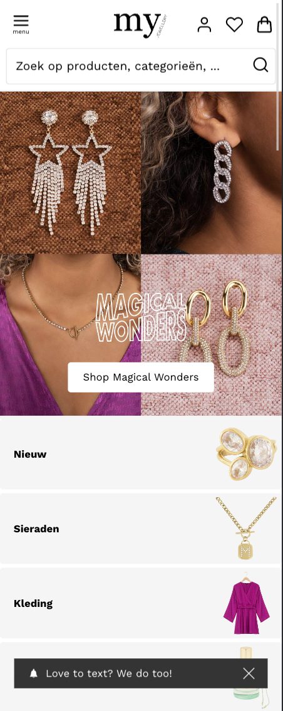
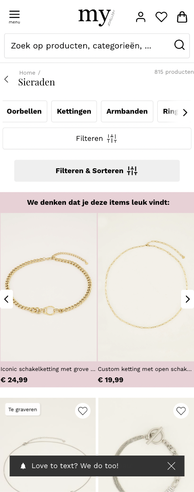
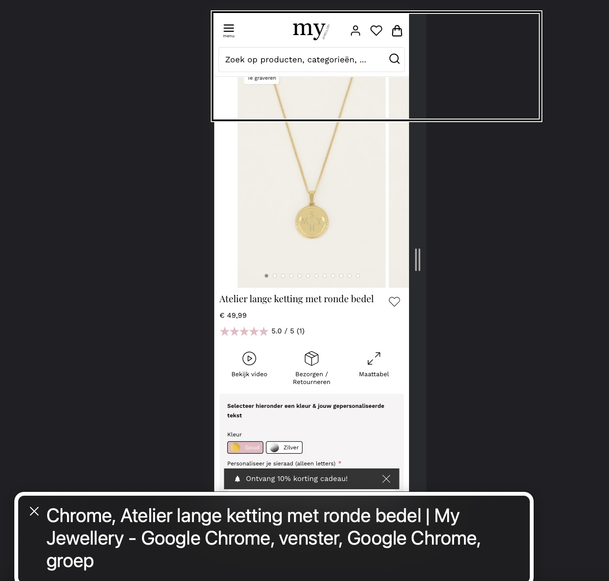
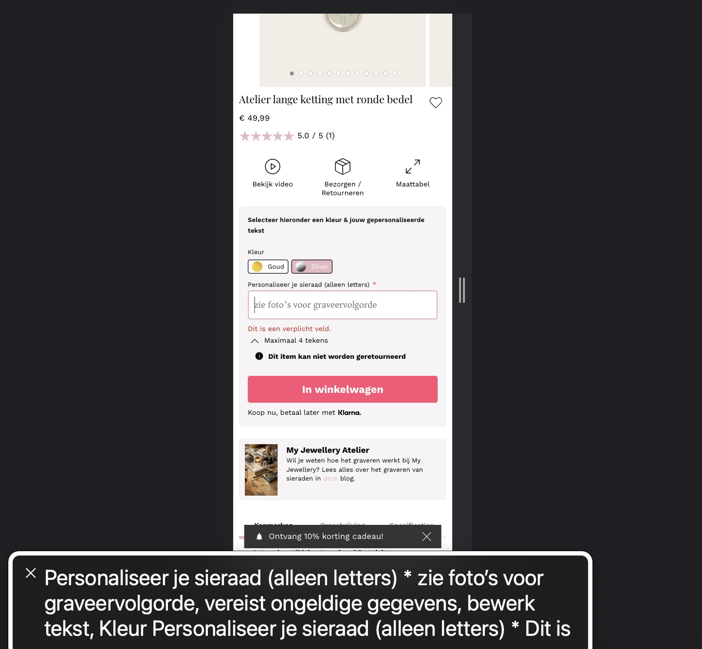

# Procesverslag
Markdown is een simpele manier om HTML te schrijven.  
Markdown cheat cheet: [Hulp bij het schrijven van Markdown](https://github.com/adam-p/markdown-here/wiki/Markdown-Cheatsheet).

Nb. De standaardstructuur en de spartaanse opmaak van de README.md zijn helemaal prima. Het gaat om de inhoud van je procesverslag. Besteedt de tijd voor pracht en praal aan je website.

Nb. Door *open* toe te voegen aan een *details* element kun je deze standaard open zetten. Fijn om dat steeds voor de relevante stuk(ken) te doen.

## Jij

  
uitwerken voor kick-off werkgroep

  ### Auteur:
  Sarah Ahmadi

  #### Je startniveau:
  Blauw

  #### Je focus:
  Responsive
 

## Je website

  
uitwerken voor kick-off werkgroep

  ### Je opdracht:
  https://www.my-jewellery.com/nl-nl/

  #### Screenshot(s) van de eerste pagina (small screen): 
  hier de naam van de pagina  
  

  #### Screenshot(s) van de tweede pagina (small screen):
  hier de naam van de pagina  
  
 

## Toegankelijkheidstest 1/2 (week 1)

  
uitwerken na test in 1e werkgroep

  ### Bevindingen
  Lijst met je bevindingen die in de test naar voren kwamen:
  -De voice-over praat heel snel, het is moeilijk om de informatie zo te onthouden.
  -Als je op de site bent en bijvoorbeeld op een sieraad klikt, zegt de voice-over tussendoor voor hoeveel procent de pagina geladen is. Dit is irritant want dit maakt voor de gebruiker niet veel uit, de gebruiker wil gewoon horen wat er te zien is op de pagina.
  -Er word door de voice-over tussendoor zoveel gepraat over random dingen die op het scherm gebeuren, waardoor het heel irritant is om te blijven luisteren.
  -De voice-over verteld hoeveel procent de pagina geladen is. Dit is niet erg relevant voor de gebruiker, dit is niet de informatie waar de gebruiker naar op zoek is. Als hij bijvoorbeeld 80% geladen is, zegt de voice-over dit. Maar ook als hij daarna 90% of 95% geladen is. Dit is alleen maar afleidend en vervelend.

  #### Screenreader
  Hier korte omschrijving (met indien nodig afbeeldingen)
  1.De voice-over praat echt niet fijn, hij praat super snel en verteld van alles wat je als gebruiker niet wilt weten en wat helemaal niet relevant is, tenminste dat vind ik persoonlijk. Een voorbeeld hiervan is dat als je op een sieraad klikt, de voice-over de naam van het sieraad zegt, maar ook 3 keer achter elkaar verteld in welke browser het geopend is, in mijn geval zei hij: Chrome, Google Chrome, venster, Google Chrome, groep. Terwijl ik als gebruiker alleen wil weten wat voor ketting het is.
  

  2.Wanneer je op een sieraad klikt die je kunt personaliseren, verteld de voice-over wel wat mogelijk is, dus hij zegt bijvoorbeeld 'alleen letters, bewerk tekst en kleur', maar hij praat zo ontzettend snel en tussendoor zegt hij nog andere dingen, waardoor je als gebruiker uiteindelijk alsnog niet precies weet wat je kan qua personalisatie, omdat je het niet allemaal kan onthouden.
  

  Probleem 1 kan opgelost worden door de screenreader zo in te kunnen stellen, dat de voice-over alleen maar verteld wat er op de site te zien is, dus de informatie die relevant is voor de gebruiker. De gebruiker hoeft niet te weten in welk browser het geopend is of hoeveel procent de pagina al geladen is.

  Probleem 2 kan opgelost worden als de screenreader weet dat het een website is waar de gebruiker bijvoorbeeld iets kan bestellen, zoals (voornamelijk) sieraden in mijn geval, de voice-over de informatie over over de sieraden rustiger verteld. Het zou fijn zijn dat als je op een ketting klikt die je zelf kan personaliseren door middel van tekst, en de beschikbare kleuren goud en zilver zijn, de screenreader deze informatie direct achter elkaar verteld, zonder onderbrekingen over andere dingen. Voorbeeld: 'Atelier lange ketting met ronde bedel. Personaliseer je sieraad. Alleen tekst. Kleuren goud en zilver.' Op deze manier is het voor de gebruiker veel duidelijker wat hij ermee kan en kan hij de informatie beter onthouden.

  #### Muis en Toetsenbord 
  Hier korte omschrijving (met indien nodig afbeeldingen)

  Hier een omschrijving van hoe het opgelost kan worden (met indien nodig afbeeldingen)

  #### Motoriek (shocks, elastiekjes)
  Hier korte omschrijving (met indien nodig afbeeldingen)

  Hier een omschrijving van hoe het opgelost kan worden (met indien nodig afbeeldingen)

  #### Visueel (brillen, contrast, kleurenblind, dark/light). 
  Hier korte omschrijving (met indien nodig afbeeldingen)

  Hier een omschrijving van hoe het opgelost kan worden (met indien nodig afbeeldingen)

## Breakdownschets (week 1)

  
uitwerken na afloop 2e werkgroep

  ### de hele pagina: 
  

  ### dynamisch deel (bijv menu): 
  

  ### wellicht nog een dynamisch deel (bijv filter): 
  

## Voortgang 1 (week 2)

  
uitwerken voor 1e voortgang

  ### Stand van zaken
  hier dit ging goed & dit was lastig (neem ook screenshots op van delen van je website en code)

  ### Agenda voor meeting
  samen met je groepje opstellen

  | student 1      | student 2          | student 3    | student 4        |
  | ---            | ---                | ---          | ---              |
  | dit bespreken  | en dit             | en ik dit    | en dan ik dat    |
  | en dat ook nog | dit als er tijd is | nog een punt | dit wil ik zeker |
  | ...            | ...                | ...          | ...              |

  ### Verslag van meeting
  hier na afloop snel de uitkomsten van de meeting vastleggen

  - punt 1
  - punt 2
  - nog een punt
  - ...

## Voortgang 2 (week 3)

  
uitwerken voor 2e voortgang

  ### Stand van zaken
  hier dit ging goed & dit was lastig (neem ook screenshots op van delen van je website en code)

  ### Agenda voor meeting
  samen met je groepje opstellen

  | student 1      | student 2          | student 3    | student 4        |
  | ---            | ---                | ---          | ---              |
  | dit bespreken  | en dit             | en ik dit    | en dan ik dat    |
  | en dat ook nog | dit als er tijd is | nog een punt | dit wil ik zeker |
  | ...            | ...                | ...          | ...              |

  ### Verslag van meeting
  hier na afloop snel de uitkomsten van de meeting vastleggen

  - punt 1
  - punt 2
  - nog een punt
- ...

## Toegankelijkheidstest 2/2 (week 4)

  
uitwerken na test in 8e werkgroep

  ### Bevindingen
  Lijst met je bevindingen die in de test naar voren kwamen (geef ook aan wat er verbeterd is):

  #### Screenreader
  Hier korte omschrijving (met indien nodig afbeeldingen)

  Hier een omschrijving van hoe het opgelost kan worden (met indien nodig afbeeldingen)

  #### Muis en Toetsenbord 
  Hier korte omschrijving (met indien nodig afbeeldingen)

  Hier een omschrijving van hoe het opgelost kan worden (met indien nodig afbeeldingen)

  #### Motoriek (shocks, elastiekjes)
  Hier korte omschrijving (met indien nodig afbeeldingen)

  Hier een omschrijving van hoe het opgelost kan worden (met indien nodig afbeeldingen)

  #### Visueel (brillen, contrast, kleurenblind, dark/light). 
  Hier korte omschrijving (met indien nodig afbeeldingen)

  Hier een omschrijving van hoe het opgelost kan worden (met indien nodig afbeeldingen)

## Voortgang 3 (week 4)

  
uitwerken voor 3e voortgang

  ### Stand van zaken
  hier dit ging goed & dit was lastig (neem ook screenshots op van delen van je website en code)

  ### Agenda voor meeting
  samen met je groepje opstellen

  | student 1      | student 2          | student 3    | student 4        |
  | ---            | ---                | ---          | ---              |
  | dit bespreken  | en dit             | en ik dit    | en dan ik dat    |
  | en dat ook nog | dit als er tijd is | nog een punt | dit wil ik zeker |
  | ...            | ...                | ...          | ...              |

  ### Verslag van meeting
  hier na afloop snel de uitkomsten van de meeting vastleggen

  - punt 1
  - punt 2
  - nog een punt
  - ...

## Eindgesprek (week 5)

  
uitwerken voor eindgesprek

  ### Je uitkomst - karakteristiek screenshots:
  

  ### Dit ging goed/Heb ik geleerd: 
  Korte omschrijving met plaatjes

  

  ### Dit was lastig/Is niet gelukt:
  Korte omschrijving met plaatjes

  

## Bronnenlijst

  
continu bijhouden terwijl je werkt

  Nb. Wees specifiek ('css-tricks' als bron is bijv. niet specifiek genoeg).

  1. bron 1
  2. bron 2
  3. ...

